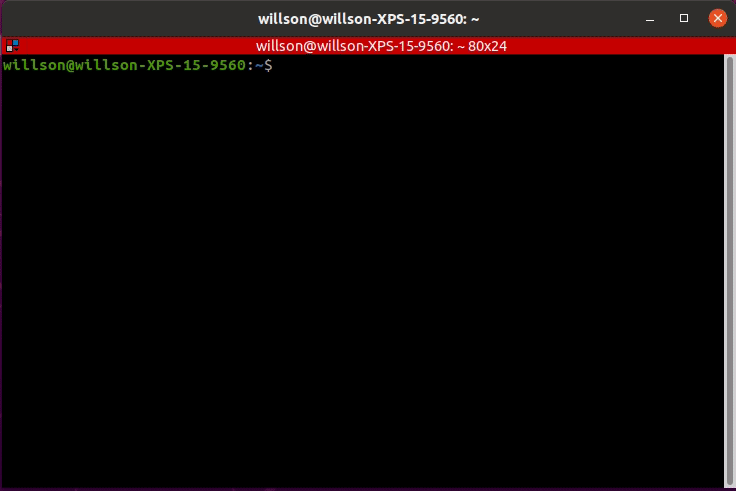

# Installation

## Assesmbly

Follow the manual of turtlebot3 burger to assemble the bot with some key things to notice:

1. The first layer uses Plate Support M3*35mm instead of M3 * 45mm
2. Second layer has PH_M3*8mm_K inserted from underneath instead of top.
3. For second, third and fourth layer, the cables need to go through the passage before the upper layer is mounted.
4. Plug the Rasberry Pi Power Cable to the correct GPIO pins with the black wire to pin 6 and red wire to pin 4.


## ROS setup

Pre-requisite:

A turtlebot, the turtlebot kit, a local PC, a MicroSD slot or card reader on local PC, an HDMI monitor, a keyboard that can use usb to connect to device, and wifi connection. (A micro-HDMI to HDMI cable is necessary if the network configuration step on local PC does not work)


After assembly, PC, SBC(Rasberry Pi) and OpenCR need to be setup in order to run ROS. Before actually installing the setup, a suitable version of ROS needs to be chosen and this affects the version of Ubuntu that needs to be installed. 


After the suitable version is chosen, follow the corresponding version setup on https://emanual.robotis.com/docs/en/platform/turtlebot3/quick-start/. The following is an example illustration of ROS Noetic setup.


### ROS Noetic setup with Raspberry Pi 4B (4GB)

### PC setup

Ubuntu 20.04 LTS needs to be installed on your local PC. It will be the main OS to run ROS. A Virtual Machine of Ubuntu 20.04 LTS would also work, just make sure it has network access, eg. It can connect to the same wifi network that turtlebots connects. A VM in VirtualBox is tested to be a viable solution.

In Ubuntu, run the following command in the terminal.

```shell
$ sudo apt update
$ sudo apt upgrade
$ wget https://raw.githubusercontent.com/ROBOTIS-GIT/robotis_tools/master/install_ros_noetic.sh
$ chmod 755 ./install_ros_noetic.sh 
$ bash ./install_ros_noetic.sh
```

```shell
$ sudo apt-get install ros-noetic-joy ros-noetic-teleop-twist-joy \
  ros-noetic-teleop-twist-keyboard ros-noetic-laser-proc \
  ros-noetic-rgbd-launch ros-noetic-rosserial-arduino \
  ros-noetic-rosserial-python ros-noetic-rosserial-client \
  ros-noetic-rosserial-msgs ros-noetic-amcl ros-noetic-map-server \
  ros-noetic-move-base ros-noetic-urdf ros-noetic-xacro \
  ros-noetic-compressed-image-transport ros-noetic-rqt* ros-noetic-rviz \
  ros-noetic-gmapping ros-noetic-navigation ros-noetic-interactive-markers
```

```shell
$ sudo apt install ros-noetic-dynamixel-sdk
$ sudo apt install ros-noetic-turtlebot3-msgs
$ sudo apt install ros-noetic-turtlebot3
```

#### ROS Network Configuration

Connect the PC to wifi and use 

```shell
$ ifconfig
```

to check the IP address of the PC under the wifi


here the IP address is 10.97.2.75. This also needs to be used for SBC setup and the correct IP addresses need to be configured correctly in order to connect local PC with turtlebots.


After checking the IP address, open the file and update the ROS IP settings with the command below.

```shell
$ nano ~/.bashrc
```

Update ROS_MASTER_URI and ROS_HOSTNAME with the PC's IP address.

A thing to notice is that the port for ROS_MASTER_URI is 11311.


After modifying the file, source the file with the following command.

```shell
$ source ~/.bashrc
```

After this, PC setup is finished.

### SBC setup

#### Installation of ROS image

On local PC:

1. Download turtlebot3 SBC image from https://emanual.robotis.com/docs/en/platform/turtlebot3/sbc_setup/#download-turtlebot3-sbc-image with the correct version that corresponds to the model of Raspberry Pi. 
2. Extract the `.img` file and save it in the local disk.
3. Download Raspberry Pi Imager from https://www.raspberrypi.com/software/
4. 

Click `CHOOSE OS`.

Click `Use custom` and select the extracted `.img` file from local disk.

Click `CHOOSE STORAGE` and select the microSD.

Click `WRITE` to start burning the image.


After this process, the ROS image is wriiten into the microSD card and Raspberry Pi can run the ROS after the microSD card is inserted.

#### System Network Configuration

To allow Raspberry Pi to connect to the desired WIFI network, the 50-cloud-init.yaml file under the /etc/netplan directory needs to be edited. 

##### On local PC

Open a terminal window on local PC with `Alt`+`Ctrl`+`T` and go to the netplan directory in the microSD card.
Start editing the `50-cloud-init.yaml` file with a superuser permission `sudo`.

```shell
$ cd /media/$USER/writable/etc/netplan
$ sudo nano 50-cloud-init.yaml
```


 replace the `WIFI_SSID` and `WIFI_PASSWORD` with wifi SSID and password.



If the file connot be configured on local PC due to any reasons, eg. cannot found the microSD directory on local PC using terminal, you can configure the network on the Raspberry Pi. (A micro-HDMI to HDMI cable is needed)


##### On Raspberry Pi

To boot up Raspberry Pi:

a. Connect the HDMI cable of the monitor to the micro-HDMI port of Raspberry Pi.
b. Connect input devices(keyboard) to the USB port of Raspberry Pi.
c. Insert the microSD card.
d. Connect the power (either with USB or OpenCR) to turn on the Raspberry Pi.

It is recommended to use OpenCR to turn on the Raspberry Pi either to connect OpenCR directory to power supply or to battery. To connect OpenCR to battery, directly plug the power cables together.

e. Login with ID `ubuntu` and PASSWORD `turtlebot`.


After booting up the Raspberry Pi,  go to /etc/netplan from root(/) directory and edit 50-cloud-init.yaml file as described above.


##### Check network configuration success

Use:

```shell
$ ifconfig
```

to check IP address. If an IP address is assigned, the Raspberry Pi is successfully connected to WIFI


#### ROS  network configuration


##### On SBC (Raspberry PI)

1. Confirm the IP address.

```shell
$ ifconfig
```

2. Edit the `.bashrc` file.

```shell
$ nano ~/.bashrc
```

3. Find the `ROS_MASTER_URI` and `ROS_HOSTNAME` setting section, then modify the IP adddresses accordingly.

```shell
export ROS_MASTER_URI=http://{IP_ADDRESS_OF_local_PC}:11311
export ROS_HOSTNAME={IP_ADDRESS_OF_RASPBERRY_PI}
```

4. Save the file with `Ctrl` + `S` and exit the nano editor with `Ctrl` + `X`.
5. Apply changes with the command below.

```shell
$ source ~/.bashrc
```


#### LDS-02 Configuration

1. Install the LDS-02 driver and update TurtleBot3 package

```shell
$ sudo apt update
$ sudo apt install libudev-dev
$ cd ~/catkin_ws/src
$ git clone -b develop https://github.com/ROBOTIS-GIT/ld08_driver.git
$ cd ~/catkin_ws/src/turtlebot3 && git pull
$ rm -r turtlebot3_description/ turtlebot3_teleop/ turtlebot3_navigation/ turtlebot3_slam/ turtlebot3_example/
$ cd ~/catkin_ws && catkin_make
```

2. Export the LDS_MODEL to the bashrc file. Depending on your LDS model, use `LDS-01` or `LDS-02`.

```shell
$ echo 'export LDS_MODEL=LDS-02' >> ~/.bashrc
$ source ~/.bashrc
```

After this, SBC setup is finished.


### OpenCR setup

1. Connect the [OpenCR](https://emanual.robotis.com/docs/en/parts/controller/opencr10/) to the Rasbperry Pi using the micro USB cable.
2. Install required packages on the Raspberry Pi to upload the [OpenCR](https://emanual.robotis.com/docs/en/parts/controller/opencr10/) firmware.

```shell
$ sudo dpkg --add-architecture armhf
$ sudo apt-get update
$ sudo apt-get install libc6:armhf
```

3. Depending on the platform, use either `burger` or `waffle` for the **OPENCR_MODEL** name.

```shell
$ export OPENCR_PORT=/dev/ttyACM0
$ export OPENCR_MODEL=burger_noetic
$ rm -rf ./opencr_update.tar.bz2
```

4. Download the firmware and loader, then extract the file.

```shell
$ wget https://github.com/ROBOTIS-GIT/OpenCR-Binaries/raw/master/turtlebot3/ROS1/latest/opencr_update.tar.bz2 
$ tar -xvf opencr_update.tar.bz2 
```

5. Upload firmware to the OpenCR.

```shell
$ cd ./opencr_update
$ ./update.sh $OPENCR_PORT $OPENCR_MODEL.opencr
```

6. A successful firmware upload for TurtleBot3 Burger will look like below.


7. If firmware upload fails, try uploading with the recovery mode. Below sequence activates the recovery mode of OpenCR. Under the recovery mode, the `STATUS` led of [OpenCR](https://emanual.robotis.com/docs/en/parts/controller/opencr10/) will blink periodically.

   - Hold down the `PUSH SW2` button.

   - Press the `Reset` button.

   - Release the `Reset` button.

     

   - Release the `PUSH SW2` button. 

   

   

### OpenCR test

You can use `PUSH SW 1` and `PUSH SW 2` buttons to see whether your robot has been properly assembled. This process tests the left and right DYNAMIXEL’s and the [OpenCR](https://emanual.robotis.com/docs/en/parts/controller/opencr10/) board.


1. After assembling TurtleBot3, connect the power to [OpenCR](https://emanual.robotis.com/docs/en/parts/controller/opencr10/) and turn on the power switch of OpenCR. The red `Power LED` will be turned on.
2. Place the robot on the flat ground in a wide open area. For the test, safety radius of 1 meter (40 inches) is recommended.
3. Press and hold `PUSH SW 1` for a few seconds to command the robot to move 30 centimeters (about 12 inches) forward.
4. Press and hold `PUSH SW 2` for a few seconds to command the robot to rotate 180 degrees in place.

After testing, opencr setup is finished.


### Bringup

After PC, SBC and opencr are properly setup, you can use bringup to test ROS connectivity and functionality.

#### Run roscore on local PC

```shell
$ roscore
```

#### Bringup turtlebot3

Note: Before executing this command, you have to specify the model name of TurtleBot3. The `${TB3_MODEL}` is the name of the model you are using in `burger`, `waffle`, `waffle_pi`.

 

1. Open a new terminal from PC with `Ctrl` + `Alt` + `T` and connect to Raspberry Pi with its IP address.
   The default password is **turtlebot**.

```shell
$ ssh ubuntu@{IP_ADDRESS_OF_RASPBERRY_PI}
```

2. Bring up basic packages to start TurtleBot3 applications.

```shell
$ export TURTLEBOT3_MODEL=${TB3_MODEL}
$ roslaunch turtlebot3_bringup turtlebot3_robot.launch
```

The command "export TURTLEBOT3_MODEL=${TB3_MODEL}" needs to be set before launching any files every time. To avoid manually set it every time, you can add this command to ~/.bashrc and source ~/.bashrc.

3. If the TurtleBot3 model is `burger`, the terminal will print below messages.

```shell
 SUMMARY
 ========

 PARAMETERS
 * /rosdistro: noetic
 * /rosversion: 1.15.8
 * /turtlebot3_core/baud: 115200
 * /turtlebot3_core/port: /dev/ttyACM0
 * /turtlebot3_core/tf_prefix:
 * /turtlebot3_lds/frame_id: base_scan
 * /turtlebot3_lds/port: /dev/ttyUSB0

 NODES
 /
     turtlebot3_core (rosserial_python/serial_node.py)
     turtlebot3_diagnostics (turtlebot3_bringup/turtlebot3_diagnostics)
     turtlebot3_lds (hls_lfcd_lds_driver/hlds_laser_publisher)

 ROS_MASTER_URI=http://192.168.1.2:11311

 process[turtlebot3_core-1]: started with pid [14198]
 process[turtlebot3_lds-2]: started with pid [14199]
 process[turtlebot3_diagnostics-3]: started with pid [14200]
 [INFO] [1531306690.947198]: ROS Serial Python Node
 [INFO] [1531306691.000143]: Connecting to /dev/ttyACM0 at 115200 baud
 [INFO] [1531306693.522019]: Note: publish buffer size is 1024 bytes
 [INFO] [1531306693.525615]: Setup publisher on sensor_state [turtlebot3_msgs/SensorState]
 [INFO] [1531306693.544159]: Setup publisher on version_info [turtlebot3_msgs/VersionInfo]
 [INFO] [1531306693.620722]: Setup publisher on imu [sensor_msgs/Imu]
 [INFO] [1531306693.642319]: Setup publisher on cmd_vel_rc100 [geometry_msgs/Twist]
 [INFO] [1531306693.687786]: Setup publisher on odom [nav_msgs/Odometry]
 [INFO] [1531306693.706260]: Setup publisher on joint_states [sensor_msgs/JointState]
 [INFO] [1531306693.722754]: Setup publisher on battery_state [sensor_msgs/BatteryState]
 [INFO] [1531306693.759059]: Setup publisher on magnetic_field [sensor_msgs/MagneticField]
 [INFO] [1531306695.979057]: Setup publisher on /tf [tf/tfMessage]
 [INFO] [1531306696.007135]: Note: subscribe buffer size is 1024 bytes
 [INFO] [1531306696.009083]: Setup subscriber on cmd_vel [geometry_msgs/Twist]
 [INFO] [1531306696.040047]: Setup subscriber on sound [turtlebot3_msgs/Sound]
 [INFO] [1531306696.069571]: Setup subscriber on motor_power [std_msgs/Bool]
 [INFO] [1531306696.096364]: Setup subscriber on reset [std_msgs/Empty]
 [INFO] [1531306696.390979]: Setup TF on Odometry [odom]
 [INFO] [1531306696.394314]: Setup TF on IMU [imu_link]
 [INFO] [1531306696.397498]: Setup TF on MagneticField [mag_link]
 [INFO] [1531306696.400537]: Setup TF on JointState [base_link]
 [INFO] [1531306696.407813]: --------------------------
 [INFO] [1531306696.411412]: Connected to OpenCR board!
 [INFO] [1531306696.415140]: This core(v1.2.1) is compatible with TB3 Burger
 [INFO] [1531306696.418398]: --------------------------
 [INFO] [1531306696.421749]: Start Calibration of Gyro
 [INFO] [1531306698.953226]: Calibration End
```

After this, basic setup for turtlebot is finished.