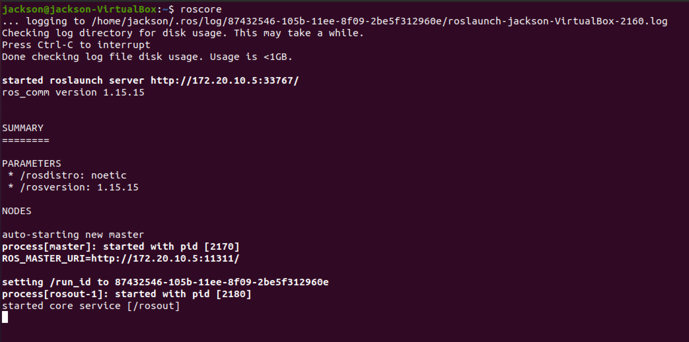
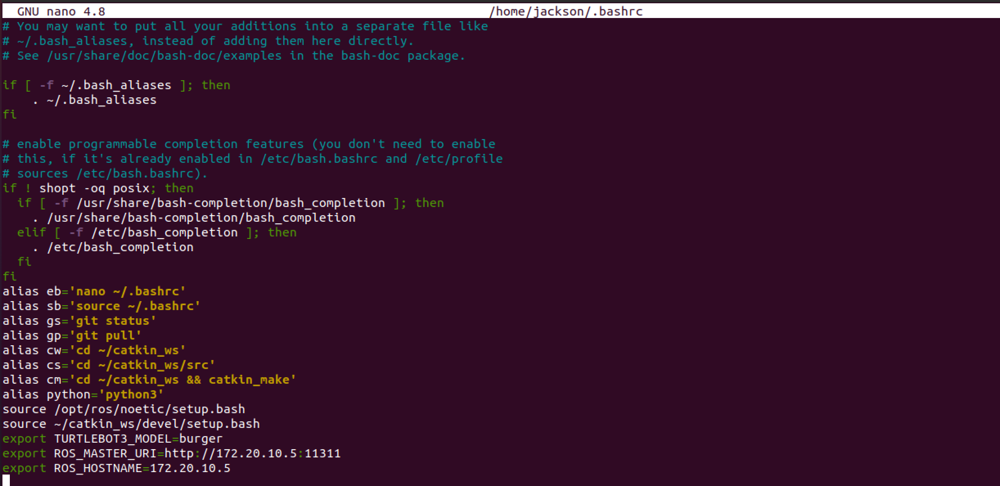
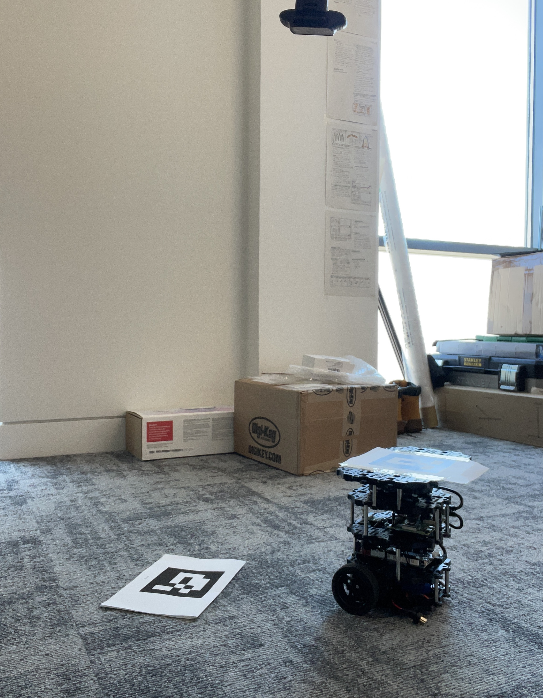
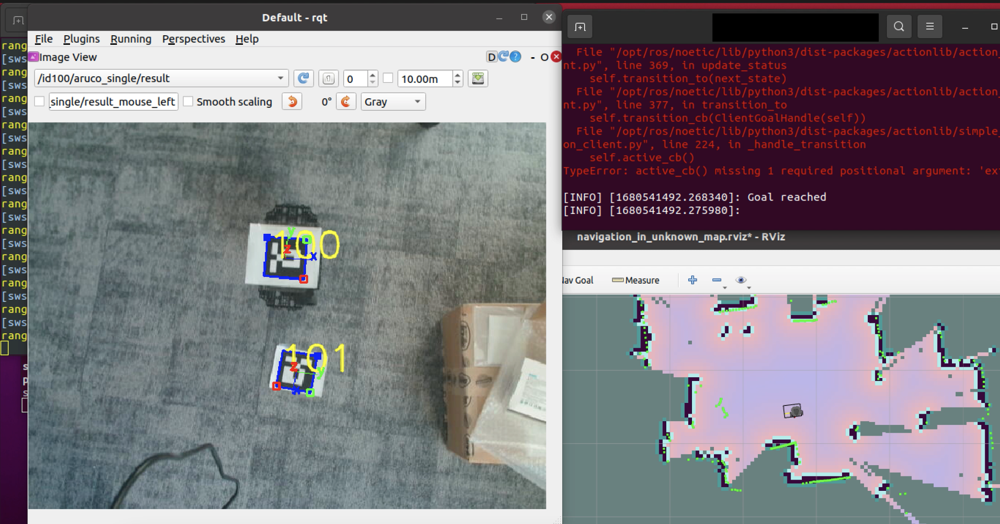
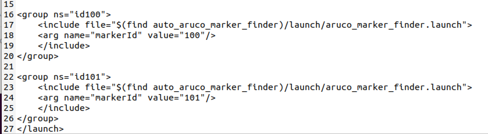

# Turtlebot Code manual

This manual introduces how to set up the environment for running the code and how to correctly pull the repository and run the code.

It is assumed that ROS has been correctly installed on both local PC and the turtlebot. For a full reference, it is recomended to read the following link.

http://wiki.ros.org/ROS/Tutorials

## catkin workspace

catkin workspace is where all the source code goes. After all installation steps are completed there should be a *catkin_ws* directory under the home directory. If the directory does not exist, run 

```shell
sudo apt-get install ros-noetic-catkin
```

in home directory with the corresponding distribution.

All custom packages and source code should go to the *catkin_ws/src* directory. 


## Pull repository

After pulling the repository, copy all packages to the *catkin_ws/src* directory and then run 

```shell
$ catkin_make
```

to build the packages and run 

```shell
$ source ~/catkin_ws/devel/setup.bash
```

to add workspace to ROS environment. Note, it may take a while to add all packages to ROS environment. 

After this step, all packages should be ready for execution.


## Run the code

### Node

A ndoe is an executable file that manipulates turtlebots to achieve some tasks. It usually subscribe or publish to a topic to allow communication between local PC and turtlebot.


### rosrun

rosrun is a ROS built-in command to run a node. Usage:

```shell
$ rosrun [package_name] [node_name]
```

Example:

```shell
$ rosrun turtlesim turtlesim_node
```


### launch file

.launch files usually contains multiple nodes. Example:

```shell
   1 <launch>
   2 
   3   <group ns="turtlesim1">
   4     <node pkg="turtlesim" name="sim" type="turtlesim_node"/>
   5   </group>
   6 
   7   <group ns="turtlesim2">
   8     <node pkg="turtlesim" name="sim" type="turtlesim_node"/>
   9   </group>
  10 
  11   <node pkg="turtlesim" name="mimic" type="mimic">
  12     <remap from="input" to="turtlesim1/turtle1"/>
  13     <remap from="output" to="turtlesim2/turtle1"/>
  14   </node>
  15 
  16 </launch>
```


```shell
   3   <group ns="turtlesim1">
   4     <node pkg="turtlesim" name="sim" type="turtlesim_node"/>
   5   </group>
   6 
   7   <group ns="turtlesim2">
   8     <node pkg="turtlesim" name="sim" type="turtlesim_node"/>
   9   </group>
```

Here we start two groups with a namespace tag of turtlesim1 and turtlesim2 with a turtlesim node with a name of sim. This allows us to start two simulators without having name conflicts. Namespace will be discussed later.

```shell
  11   <node pkg="turtlesim" name="mimic" type="mimic">
  12     <remap from="input" to="turtlesim1/turtle1"/>
  13     <remap from="output" to="turtlesim2/turtle1"/>
  14   </node>
```

Here we start the mimic node with the topics input and output renamed to turtlesim1 and turtlesim2. This renaming will cause turtlesim2 to mimic turtlesim1.


### roslaunch

`roslaunch` starts nodes as defined in a launch file. Usage:

```shell
$ roslaunch [package] [filename.launch]
```

Example:

```shell
$ roslaunch beginner_tutorials turtlemimic.launch
```


### Run applications

The following steps will introduce how to run applications using rosrun and roslaunch.

Make sure local PC and turtlebots are connected to the same network and IP addresses and configured properly.

1. On local PC, run

```shell
$ roscore
```

A successful installation of ROS and successful execution of roscore would look like this:



2. Turtlebot bringup

- run 

```shell
$ ssh ubuntu@{IP_ADDRESS_OF_RASPBERRY_PI}
```

to ssh to turtlebot, default password is __turtlebot__.

- Bring up basic packages to start TurtleBot3 applications by running:

```shell
$ roslaunch turtlebot3_bringup turtlebot3_robot.launch
```

This will boot up the basic publishers and subscribers on turtlebot.


After turtlebot bringup, you can run the applications by using rosrun and roslaunch on local PC. But before running any applications, the following command needs to be run:

```shell
$ export TURTLEBOT3_MODEL=${TB3_MODEL}
```

Replace the `${TB3_MODEL}` parameter with your model name such as `burger`, `waffle`, `waffle_pi`.

To avoid manually set it every time, you can add this command to ~/.bashrc and source ~/.bashrc. 

An example looks like this:




#### Application example:

##### Teleoperaiton

After bringup, run 

```shell
$ roslaunch turtlebot3_teleop turtlebot3_teleop_key.launch
```

on local PC to launch the teleoperation of turtlebot. 

If the node is successfully launched, the following instruction will be appeared to the terminal window.

```en
Control Your Turtlebot3
Moving around
     w
 a   s   d
     x
w/x : increase/decrease linear velocity
a/d : increase/decrease angular velocity
space key, s : force stop
CTRL-C to quit
```


##### Naive obstacle avoidance

To run naive obstacle avoidance node in the repository on a single turtlebot,

run

```shell
$ rosrun naive_obstacle_avoidance naive_obstacle_avoidance_node
```


### Applications in multi-turtlebot environment

To allow applications that manipulates multiple turtlebots, namespace is used. 

#### robot_obstacle_avoidance

To run multi_robot_obstacle_avoidance, in bringup process, on first turtlebot, run

```shell
ROS_NAMESPACE=tb3_0 roslaunch turtlebot3_bringup turtlebot3_robot.launch multi_robot_name:="tb3_0" set_lidar_frame_id:="tb3_0/base_scan"
```

On second turtlebot, run 

```shell
$ ROS_NAMESPACE=tb3_1 roslaunch turtlebot3_bringup turtlebot3_robot.launch multi_robot_name:="tb3_1" set_lidar_frame_id:="tb3_1/base_scan"
```

Then on local PC, run 

``` shell
$ roslaunch multi_robot_obstacle_avoidance multi_robot_obstacle_avoidance.launch
```

If you bringup the turtlebot with namespace but only wants to manipulate one of the turtlebots, run 

```shell
$ ROS_NAMESPACE=tb3_0 roslaunch turtlebot3_teleop turtlebot3_teleop_key.launch multi_robot_name:=tb3_0
```

with the corresponding namespace.


### Auto-Navigation and ArUco marker

Prerequisite: A usb camera, a checkerboard and ArUco markers

ArUco marker generator: https://chev.me/arucogen/

Checker board: http://wiki.ros.org/camera_calibration/Tutorials/MonocularCalibration?action=AttachFile&do=view&target=check-108.pdf

A digital checker board is ok. You can use your phone or ipad to display the checkerboard when calibration.

#### Environment setup for ArUco marker

A full tutorial can be found here:

https://ros-developer.com/2017/04/23/aruco-ros/

https://ros-developer.com/2017/04/23/camera-calibration-with-ros/

After this, the camera should be calibrated correctly in order to detect ArUco markers.


After installation, set up the real world environment like this:



Make sure the camera is on top of the two ArUco marker and the ArUco markers are large enough to be detected. In the example, another layer is borrowed from a new turtlebot kit in order to make the large ArUco marker to stick on top of the turtlebot.


#### To run auto navigation:

In auto navigation, the camera detect the marker on top of the robot and the marker on the ground. The marker on the ground is the goal position and the application allow the robot to navigate from its original position to the goal position.

Firstly, the id number of ArUco markers being used need to be remember. In the example, marker on robot has id 100 and marker on the ground has ID 101. Different IDs can be used with modificatioln in the code in order to correctly detect and read marker positions.

1. On local PC, run

``` shell
$ roscore
```

2. On local PC, open a new terminal window and run

```shell
$ ssh ubuntu@{IP_ADDRESS_OF_RASPBERRY_PI}
```

password is __turtlebot__

3. On ssh terminal, run

```shell
$ roslaunch turtlebot3_bringup turtlebot3_robot.launch
```

4. On local PC, open a new terminal window and run

```shell
$ roslaunch auto_aruco_marker_finder multiple_aruco_marker_finder.launch
```

5. (optional) To check if markers are correctly detected, run

```shell
$ rosrun rqt_gui rqt_gui
```

Correct detection should look like this:




The rqt window shows a correct detection.


6. On local PC, open a new terminal and run

```shell
$ rosrun auto_navigation goal_pose.py
```

Then the robot should be moving to the destination.

If the robot is not moving and error occurs on the terminal, shutdown all terminal and repeat from step 1.


To change the ID number being used:

1. In __multiple_aruco_marker_finder.launch__ file under __auto_aruco_marker_finder/launch__ directory, change the following:



from id100 and id101 to idxxx where xxx is the id number being used.

2. In goal_pose.py file, change id100 and id101 accordingly.

After this, auto navigation should be running properly.


