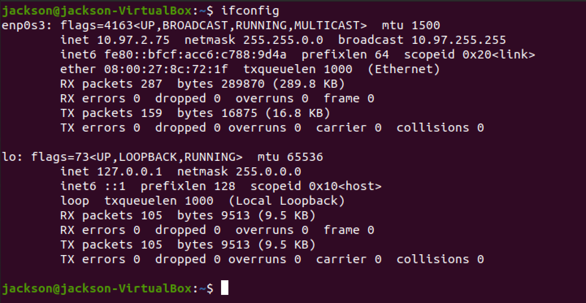

# Installation

## Assesmbly

Follow the manual of turtlebot3 burger to assemble the bot with some key things to notice:

1. The first layer uses Plate Support M3*35mm instead of M3 * 45mm
2. Second layer has PH_M3*8mm_K inserted from underneath instead of top.
3. For second, third and fourth layer, the cables need to go through the passage before the upper layer is mounted.
4. Plug the Rasberry Pi Power Cable to the correct GPIO pins with the black wire to pin 6 and red wire to pin 4.


## ROS setup

Pre-requisite:

A local PC, a MicroSD slot or card reader, an HDMI monitor, a keyboard, and wifi connection.


After assembly, PC, SBC(Rasberry Pi) and OpenCR need to be setup in order to run ROS. Before actually installing the setup, a suitable version of ROS needs to be chosen and this affects the version of Ubuntu that needs to be installed. 


After the suitable version is chosen, follow the corresponding version setup on https://emanual.robotis.com/docs/en/platform/turtlebot3/quick-start/. The following is an example illustration of ROS Noetic setup.


### ROS Noetic setup

### PC setup

Ubuntu 20.04 LTS needs to be installed on your local PC. It will be the main OS to run ROS. A Virtual Machine of Ubuntu 20.04 LTS would also work, just make sure it has network access, eg. It can connect to the same wifi network that turtlebots connects. A VM in VirtualBox is tested to be a viable solution.

In Ubuntu, run the following command in the terminal.

```shell
$ sudo apt update
$ sudo apt upgrade
$ wget https://raw.githubusercontent.com/ROBOTIS-GIT/robotis_tools/master/install_ros_noetic.sh
$ chmod 755 ./install_ros_noetic.sh 
$ bash ./install_ros_noetic.sh
```

```shell
$ sudo apt-get install ros-noetic-joy ros-noetic-teleop-twist-joy \
  ros-noetic-teleop-twist-keyboard ros-noetic-laser-proc \
  ros-noetic-rgbd-launch ros-noetic-rosserial-arduino \
  ros-noetic-rosserial-python ros-noetic-rosserial-client \
  ros-noetic-rosserial-msgs ros-noetic-amcl ros-noetic-map-server \
  ros-noetic-move-base ros-noetic-urdf ros-noetic-xacro \
  ros-noetic-compressed-image-transport ros-noetic-rqt* ros-noetic-rviz \
  ros-noetic-gmapping ros-noetic-navigation ros-noetic-interactive-markers
```

```shell
$ sudo apt install ros-noetic-dynamixel-sdk
$ sudo apt install ros-noetic-turtlebot3-msgs
$ sudo apt install ros-noetic-turtlebot3
```

#### Network Configuration

Connect the PC to wifi and use 

```shell
$ ifconfig
```

to check the IP address of the PC under the wifi



here the IP address is 10.97.2.75. This also needs to be used for SBC setup and the correct IP addresses need to be configured correctly in order to connect local PC with turtlebots.


After checking the IP address, open the file and update the ROS IP settings with the command below.

```shell
$ nano ~/.bashrc
```

Update ROS_MASTER_URI and ROS_HOSTNAME with the PC's IP address.

A thing to notice is that the port for ROS_MASTER_URI is 11311.


After modifying the file, source the file with the following command.

```shell
$ source ~/.bashrc
```

After this, PC setup is finished.

### SBC setup

On local PC:

1. Download turtlebot3 SBC image from https://emanual.robotis.com/docs/en/platform/turtlebot3/sbc_setup/#download-turtlebot3-sbc-image with the correct version that corresponds to the model of Raspberry Pi. 
2. Extract the `.img` file and save it in the local disk.
3. Download Raspberry Pi Imager from https://www.raspberrypi.com/software/
4. 

Click `CHOOSE OS`.

Click `Use custom` and select the extracted `.img` file from local disk.

Click `CHOOSE STORAGE` and select the microSD.

Click `WRITE` to start burning the image.


#### Network Configuration

